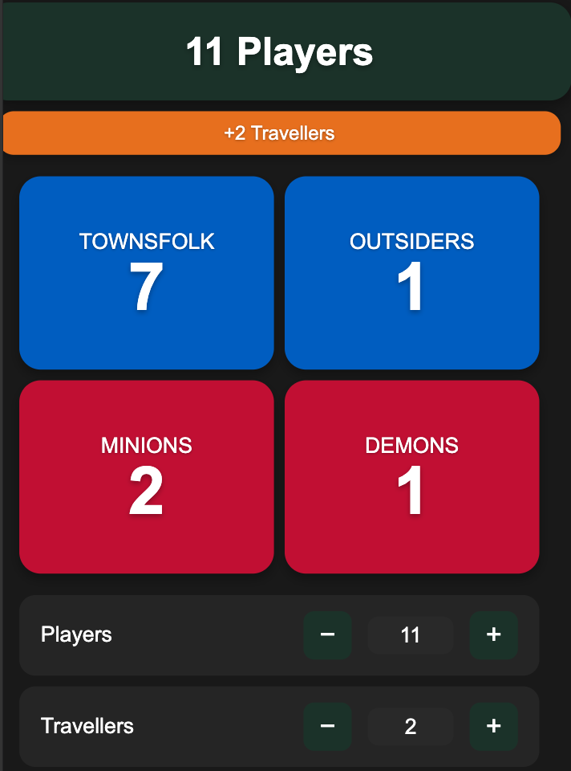

# Players' Clocktower

A simple web application for tracking player counts in Blood on the Clocktower
games.

## Live Version

Visit [count.arcane-scripts.net](https://count.arcane-scripts.net) to use the live
version.

## Overview

This mini-app helps Blood on the Clocktower players track:

- Current player count
- Number of travellers
- Game state (day/night)
- Current day number

## Features

- Simple, intuitive interface
- Responsive design that works on both desktop and mobile
- Real-time updates
- Easy player count and traveller tracking
- Day/night cycle tracking
- Day number counter

## Development

This is a vanilla JavaScript application built with HTML and CSS.
